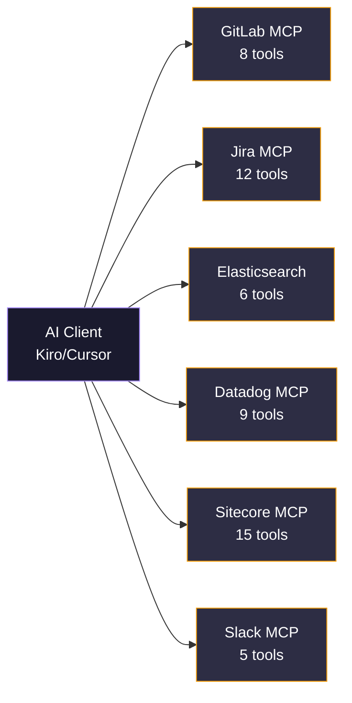
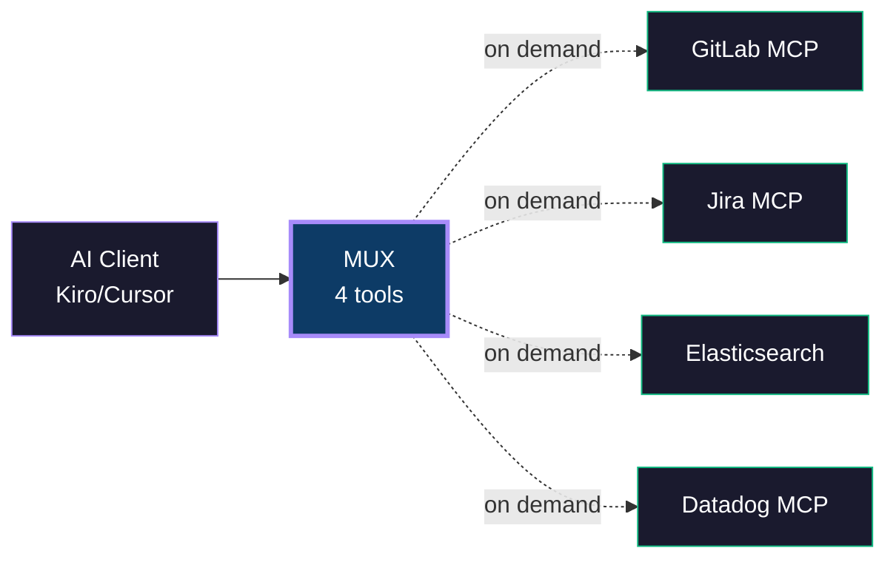

<div align="center">
  <br/>
  <picture>
    <source media="(prefers-color-scheme: dark)" srcset="https://img.shields.io/badge/MUX-MCP_Gateway_Router-a78bfa?style=for-the-badge&labelColor=0d1117">
    
  </picture>
  <br/><br/>
  <strong>One MCP to rule them all.</strong>
  <br/>
  <sub>A lightweight gateway that multiplexes multiple MCP servers behind a single always-on endpoint.</sub>
  <br/><br/>
  <a href="https://mux-gateway.vercel.app"></a>
  <a href="docs/architecture.md"></a>
  <a href="docs/cli.md"></a>
  <a href="docs/auth.md"></a>
  <br/>
  
  
  
  
  
  <br/><br/>
  <a href="https://mux-gateway.vercel.app"><strong>Visit the Website</strong></a>
  <br/><br/>
</div>

---

## Why Mux?

> [!IMPORTANT]
> Running 15+ MCP servers = **50+ tools** in your AI's context window, wasted RAM, and constant OAuth re-auth. Mux reduces this to **4 tools, 1 process, zero re-auth**.

Modern AI editors (Kiro, Cursor, Claude Desktop) connect to MCP servers for tool access. In real-world setups, you accumulate **10-20+ servers** — GitLab, Jira, Elasticsearch, Datadog, Sitecore, Slack, and more. Running them all simultaneously creates three critical issues:

| Issue | Impact |
|:------|:-------|
| **Context bloat** | Every server's tool schemas consume AI context tokens. 15 servers = 50+ tools competing for attention. |
| **Resource waste** | Each server runs as a separate process consuming RAM, even if unused for hours. |
| **Re-authentication** | OAuth-based servers lose their session when disabled, requiring browser re-auth every single time. |

---

## The Solution

Mux sits between your AI client and all your MCP servers. It exposes **exactly 4 tools** — regardless of how many downstream servers exist. Servers are spawned on demand, killed when idle, and their auth tokens persist across sessions.

> ### Before Mux



  

> ### After Mux



  

---

## Install

```bash
npm install -g mux-mcp-gateway
```

Or via the install script:

```bash
curl -sL https://mux-gateway.vercel.app/install.sh | bash
```

Then run:

```bash
mux-cli
```

That's it. Mux imports your existing MCP config, patches your AI client, and you're done.

---

## How It Works

| Step | What happens |
|------|-------------|
| 1 | AI calls `mux_call_tool("gitlab", "list_mrs", {...})` |
| 2 | Mux spawns GitLab MCP server (if not running) |
| 3 | Routes the call, returns the result |
| 4 | After 5 min idle → kills the connection |

Your AI only sees **4 tools** regardless of how many servers are registered.

---

## Documentation

| | |
|:--|:--|
| <a href="docs/cli.md"></a> | [All `mux-cli` commands — setup, add, remove, auth, health, metrics, keywords](docs/cli.md) |
| <a href="docs/config.md"></a> | [`servers.json` schema, environment variables, hot-reload registry](docs/config.md) |
| <a href="docs/clients.md"></a> | [Setup guides for Kiro, Cursor, and Claude Desktop](docs/clients.md) |
| <a href="docs/architecture.md"></a> | [System design, pool manager, transport layer, data flow](docs/architecture.md) |
| <a href="docs/tools.md"></a> | [`mux_list_servers` · `mux_call_tool` · `mux_find_tool` · `mux_status`](docs/tools.md) |
| <a href="docs/auth.md"></a> | [OAuth flow, token caching, persistent sessions across restarts](docs/auth.md) |
| <a href="docs/lifecycle.md"></a> | [Spawn → active → idle → reaped state machine](docs/lifecycle.md) |
| <a href="docs/comparison.md"></a> | [Context reduction, resource savings, auth improvements](docs/comparison.md) |
| <a href="docs/tech-stack.md"></a> | [Runtime, build tools, supported transports](docs/tech-stack.md) |
| <a href="docs/development.md"></a> | [Project structure, test suite, local dev workflow](docs/development.md) |

---

## Why run locally?

Mux runs as a local stdio process by design. Your credentials (tokens, API keys) stay on your machine — they're injected via environment variables and never leave your shell session. Downstream servers enforce access based on **your** tokens, so Mux has no elevated privileges.

This means:
- No shared credential store to secure
- No multi-tenancy complexity
- No token management service needed
- OAuth tokens persist in `~/.mux/tokens.json` (AES-256-GCM encrypted, 0600 permissions)

---

## Quick CLI Reference

```bash
mux-cli setup              # Import from existing mcp.json
mux-cli add <name> '<json>'  # Add a server
mux-cli remove <name>      # Remove a server
mux-cli auth --all         # Authorize all HTTP servers
mux-cli health             # Health check
mux-cli list               # Show servers + status
mux-cli metrics            # Usage insights dashboard
mux-cli keywords [name]    # View/edit keywords
mux-cli update             # Update to latest version
mux-cli uninstall          # Remove Mux completely
```

---

## Author

<p>
  <a href="https://github.com/BhavanPatel"></a>
  <br/>
  <a href="https://github.com/BhavanPatel"></a>
  <a href="https://mux-gateway.vercel.app"></a>
</p>

## License

MIT
