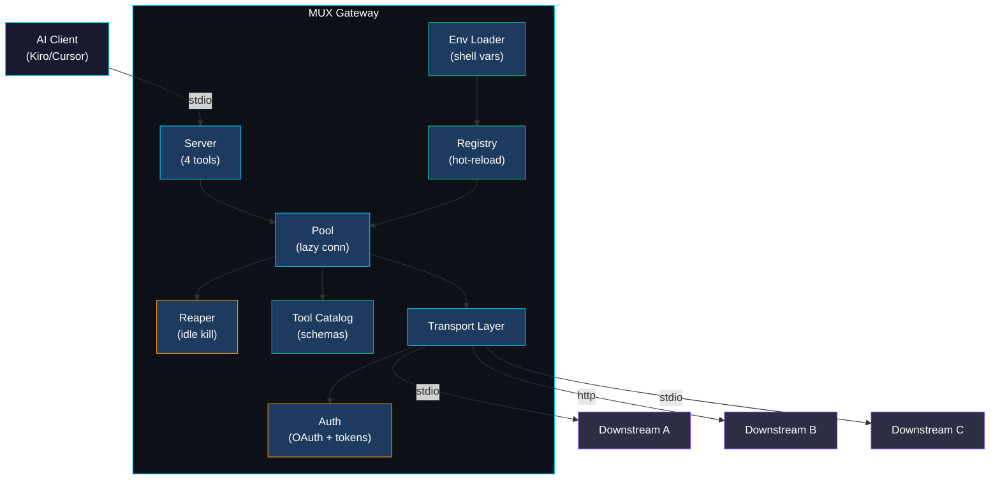
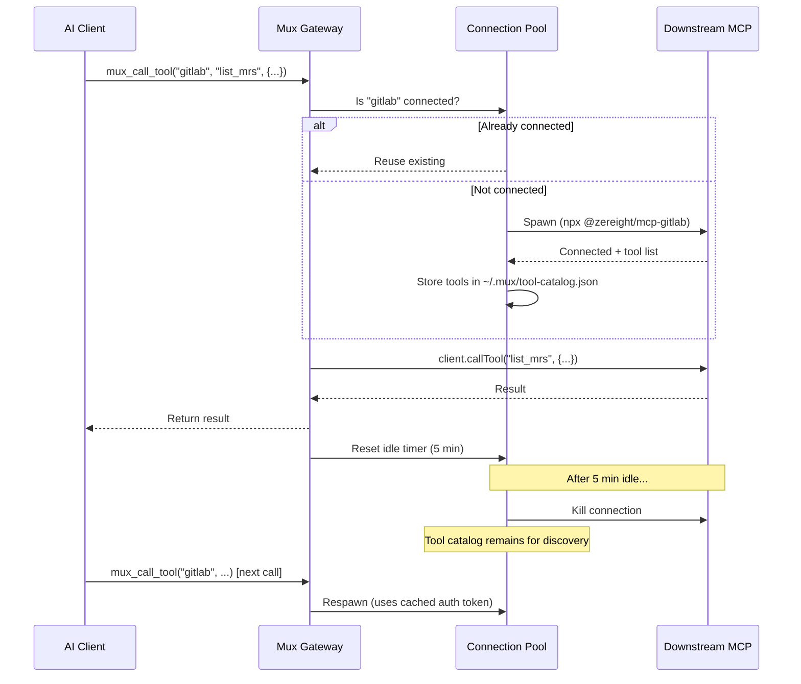
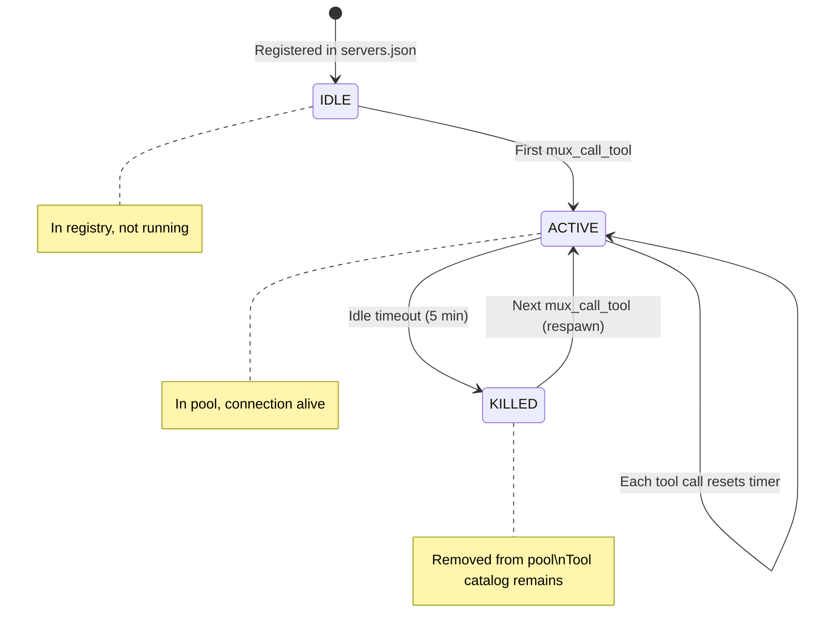

## Architecture

### System Design

### Component Breakdown

| Component | File | Responsibility |
|:----------|:-----|:---------------|
| **Server** | `src/server.ts` | MCP server exposing 4 tools to the AI client |
| **Registry** | `src/registry.ts` | Loads `servers.json`, interpolates env vars, watches for changes, scored keyword matching |
| **Pool** | `src/pool.ts` | Connection lifecycle — lazy connect, reuse, disconnect, auto-retry on failure |
| **Keyword Extractor** | `src/keyword-extractor.ts` | Extracts keywords from tool names/descriptions for auto-tagging servers |
| **Reaper** | (inside pool) | Per-connection idle timer — kills unused connections |
| **Tool Catalog** | `src/tool-catalog.ts` | Persists discovered tool schemas in `~/.mux/tool-catalog.json` (1h TTL) |
| **Tool Discovery** | `src/tool-discovery.ts` | Searches tool catalog across servers, resolves server by tool name |
| **Env Loader** | `src/env.ts` | Extracts env vars from shell profiles (.zshrc/.bashrc) on startup |
| **Stdio Transport** | `src/transport/stdio.ts` | Spawns downstream processes, communicates via stdin/stdout |
| **HTTP Transport** | `src/transport/http.ts` | Connects to HTTP/SSE endpoints with MCP OAuth provider |
| **OAuth Provider** | `src/auth/mcp-oauth-provider.ts` | Browser-based OAuth (same flow as Kiro IDE/CLI) |
| **Token Store** | `src/auth/token-store.ts` | Reads/writes encrypted `~/.mux/tokens.json`, checks expiry |
| **Logger** | `src/logger.ts` | Structured stderr logging with levels |

### Data Flow

### Lifecycle States

---
