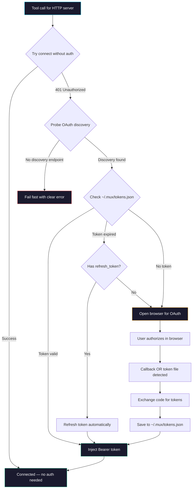

## Authentication

### How Auth Works



### Smart Auth Detection

Mux now uses a **two-phase connection strategy** that avoids false auth triggers:

1. **Phase 1: Try without auth** — Connects to the server without an OAuth provider. If it succeeds, no auth is needed (e.g., servers using API key headers).
2. **Phase 2: Probe OAuth discovery** — If the server returns 401, Mux probes `/.well-known/oauth-authorization-server` on the server's origin. Only if the server has a valid OAuth discovery endpoint (with `authorization_endpoint`) does Mux trigger the browser auth flow.
3. **Fail fast** — If the server returns 401 but has no OAuth discovery, Mux immediately fails with a clear error message instead of waiting 120s for a callback that will never come.

This means:
- Servers with API key headers (Datadog, etc.) → connect instantly, no OAuth popup
- Internal services without OAuth → fail fast with actionable error
- OAuth-enabled servers (GitLab, Sitecore, etc.) → normal auth flow as before

### Auth Types Supported

| Type | Config | Behavior |
|:-----|:-------|:---------|
| **None** | No `env`/`headers`/`auth` | Direct connection, no credentials |
| **Env tokens** | `env: { "TOKEN": "${VAR}" }` | Injected from shell environment at startup |
| **Static headers** | `headers: { "X-API-Key": "${KEY}" }` | Injected into every HTTP request |
| **OAuth (browser)** | Server returns 401 + has OAuth discovery | Mux opens browser → you authorize → token cached |

### Browser-Based OAuth (HTTP Servers)

Most HTTP MCP servers (GitLab, Jira, Slack, ServiceNow, Datadog, Sitecore) use the **MCP protocol's built-in OAuth**. When Mux connects and gets a 401:

1. Mux probes the server's `/.well-known/oauth-authorization-server` endpoint
2. If OAuth metadata is found, Mux opens your browser with the authorization URL
3. You click "Authorize" in the browser
4. Browser redirects back to `localhost:48912/callback`
5. Mux exchanges the auth code for tokens and caches them

**This is the same flow as Kiro IDE/CLI** — no extra configuration needed. First call triggers auth, subsequent calls use the cached token. If the token expires, it auto-refreshes using the refresh token.

### Early Auth Completion

Mux now detects externally-completed authorization immediately:

- **Token file polling** — While waiting for the OAuth callback, Mux polls `~/.mux/tokens.json` every 1s. If tokens appear (e.g., from a redirect flow that writes directly), it resolves immediately without waiting for the callback.
- **Countdown timer** — During the auth wait, a countdown is displayed to stderr so you can see how much time remains:
  ```
  [MUX] ⏳ Waiting for "sitecore" authorization... 95s remaining
  ```
- **Instant resolution** — As soon as auth completes (via callback OR token detection), the timer clears and connection proceeds.

> [!TIP]
> Pre-authorize all HTTP servers after setup: `mux-cli auth --all`

### Token Persistence

Tokens are stored in `~/.mux/tokens.json` with file permissions `0600` (owner read/write only).

```json
{
  "sitecore": {
    "accessToken": "eyJ...",
    "refreshToken": "dGhp...",
    "expiresAt": 1719320400000,
    "scopes": ["openid", "sitecore.profile"]
  }
}
```

**Token lifecycle:**
- Cached token valid → used immediately (no browser popup)
- Token expiring within 60s → refreshed automatically via refresh_token
- Refresh token expired → one-time browser OAuth flow, new tokens cached
- Server disabled/re-enabled → tokens survive (that's the whole point)

---
