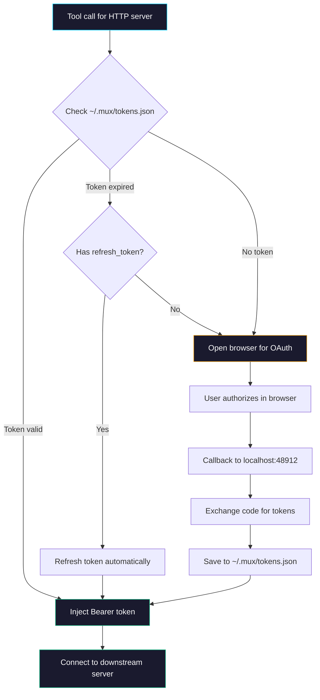

## Authentication

### How Auth Works



### Auth Types Supported

| Type | Config | Behavior |
|:-----|:-------|:---------|
| **None** | No `env`/`headers`/`auth` | Direct connection, no credentials |
| **Env tokens** | `env: { "TOKEN": "${VAR}" }` | Injected from shell environment at startup |
| **Static headers** | `headers: { "X-API-Key": "${KEY}" }` | Injected into every HTTP request |
| **OAuth (browser)** | Server returns 401 | Mux opens browser → you authorize → token cached |

### Browser-Based OAuth (HTTP Servers)

Most HTTP MCP servers (GitLab, Jira, Slack, ServiceNow, Datadog, Sitecore) use the **MCP protocol's built-in OAuth**. When Mux connects and gets a 401:

1. The MCP SDK discovers the server's OAuth metadata automatically
2. Mux opens your browser with the authorization URL
3. You click "Authorize" in the browser
4. Browser redirects back to `localhost:48912/callback`
5. Mux exchanges the auth code for tokens and caches them

**This is the same flow as Kiro IDE/CLI** — no extra configuration needed. First call triggers auth, subsequent calls use the cached token. If the token expires, it auto-refreshes using the refresh token.

> [!TIP]
> Pre-authorize all HTTP servers after setup: `mux-cli auth --all`

### Token Persistence

Tokens are stored in `~/.mux/tokens.json` with file permissions `0600` (owner read/write only).

```json
{
  "sitecore": {
    "accessToken": "eyJ...",
    "refreshToken": "dGhp...",
    "expiresAt": 1719320400000,
    "scopes": ["openid", "sitecore.profile"]
  }
}
```

**Token lifecycle:**
- Cached token valid → used immediately (no browser popup)
- Token expiring within 60s → refreshed automatically via refresh_token
- Refresh token expired → one-time browser OAuth flow, new tokens cached
- Server disabled/re-enabled → tokens survive (that's the whole point)

---
